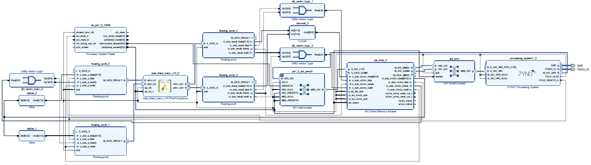

# Convolutional Neural Network (CNN) image classification of handwritten digits in Xilinx FPGA

This project was developed for the Hardware-Software Co-Design course. It consists on classifying 28×28 grayscale images of handwritten digits from the [MNIST dataset](http://yann.lecun.com/exdb/mnist/) using a trained CNN whose design was proposed [here](http://neuralnetworksanddeeplearning.com/chap6.html). The objective is to implement the algorithm in a Hardware-Software architecture, for a Xilinx FPGA (Zybo), in order to speedup its performance in comparison with the only software version.  

## CNN architecture

## Input files

**wb.bin** -> Binary file with 22+22x5x5+10+10x22x12x12 floating-point neural net weights 

**t100-images-idx3-ubyte** -> Contains header (16 bytes) plus 100 example images (100x28x28 bytes)

## Software version only

In the sw-only folder, there are the C scripts that are supposed to run only in the FPGA ARM processor (using the Xilinx SDK toolchain). The performance obtained through this version works as a baseline for calculating the speed-up of the Hardware-Software version.

## Hardware-Software version

The input data (images and weights) and the output data (output of each layer) are stored in the DDR, whose access is made using a DMA through the PS HP0 port. The IP developed (c++ code is inside hw-sw/hls folder) uses AXI-Stream interface to read and write data sequentially. This IP implements the first two layers of the CNN using MACCs in fixed-point format (that is why there are floating-point Xilinx IPs in the architecture) while the rest is implemented by both FPGA ARM processors (c code of each one is inside hw-sw/sdk folder). For speeding up the performance (in comparison with the sw version only), 3 main techniques were applied:

**1) Hardware parallelism of the convolutional layer:** execution of the 22 convolutions of the first layer in parallel using 44 MACCs. In order not to exceed the number of DSP available on the Zybo FPGA (80 in total), each image pixel was in format Q0.8 and each weight was in format Q1.16. There were also used 44 comparators and 44 registers to implement the second layer in parallel. Note that, for each convolution, two results were determined at the same time (44/22=2).

**2) 64 bits DMA:** By using the DMA with 64 bits (instead of the default 32 bits configuration), it is possible to send 2 results (from the IP to the processor) at the same clock cycle (as each result is 32 bits in floating-point format). This is the reason why, for each convolution, two results are determined at the same time, as explained above.

**3) Using both ARM processor:** As one can see in the CNN architecture design above, the third layer consists on 10 convolutions (with size 22x12x12 each). To boost the performance of this layer on software, each ARM processor executes 5 convolutions. A semaphore flag, created on the shared memory space, was used for ensuring the synchronization between both processors.

## Memory mapping

|      Data      |          Address         |    Memory Region  |   
|:---------------|:-------------------------|:------------------|
| Program P0     | 0x00000000 - 0x00020000  |     ram0 (OCM)    |
| Program P1     | 0x00020000 - 0x00030000  |     ram0 (OCM)    |
| Images         | 0x10000000 - 0x11000000  |         DDR       |
| Weights        | 0x11000000 - 0x12000000  |         DDR       |
| Results        | 0x12000000 - 0x1FF00000  |         DDR       |
| Shared memory  | 0xFFFF0000 - 0xFFFFFFFF  |     ram1 (OCM)    |

## FPGA logic primitives

As one can see, the bottleneck of the IP developed was the number of BRAM used (85%), which dit not allow parallelizing the first layer even more.

|       Resource      |    LUT   |    FF    |   BRAM   |   DSP   |    
|:--------------------|:---------|:---------|:---------|:--------|
|      AXI DMA        |   1573   |   2218   |     3    |    0    |
| AXI Smart Connect   |   1968   |   2816   |     0    |    0    |
|      IP Block       |   8991   |   6592   |    48    |   44    |
|         PS          |     0    |     0    |     0    |    0    |
| PS AXI Interconnect |    377   |    484   |     0    |    0    |
|       Others        |   1035   |   1669   |     0    |    0    |
|       Total         |   13944  |   13779  |    51    |   44    |
|     Percentage      |   79,23% |   39,14% |   85,00% |  55,00% |

## Temporal characteristics
For a frequency of 100 MHz, the WNS (Worst Negative Slack) was 0,4 ns and the WHS (Worst Hold Stack) was 0,016 ns

## Speed-up

Applying the algorithm to the 100 images:

|    Compiler Mode    |      SW-only     |      HW-SW     |   Speed-up   |
|:--------------------|:-----------------|:---------------|:-------------|
|         O0          |   3 717 232 us   |   120 496 us   |     30,85    |
|         O3          |    516 971 us    |   41 705  us   |     12,40    |