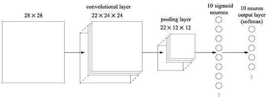

# Convolutional Neural Network (CNN) image classification of handwritten digits in Xilinx FPGA

This project was developed for the Hardware-Software Co-Design course. It consists on classifying 28×28 grayscale images of handwritten digits from the [MNIST dataset](http://yann.lecun.com/exdb/mnist/) using a trained CNN whose design was proposed [here](http://neuralnetworksanddeeplearning.com/chap6.html). The objective is to implement the algorithm in a Hardware-Software architecture, for a Xilinx FPGA (Zybo), in order to speedup its performance in comparison with the only software version.  

## CNN architecture

